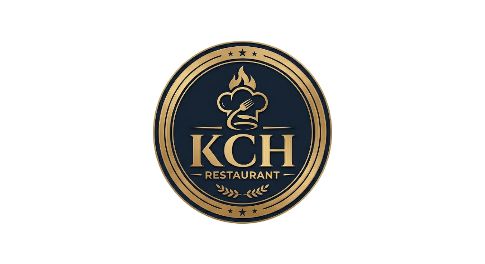

<div align="center">
  
  <h1>KCH Restaurant POS System</h1>
  <p>A fast, modern, full-stack Point of Sale application built to streamline restaurant operations.</p>
</div>

---

## 🌟 Features

- **🍔 Menu Management:** Easily add, edit, or remove menu items from the dashboard.
- **🛒 Order Processing:** Quick and intuitive interface for taking customer orders.
- **💳 Checkout System:** Built-in modal for cash and card transactions.
- **📊 Income Reporting:** Auto-generated income sheets to track daily sales.
- **⚙️ Settings Dashboard:** Manage system preferences cleanly and securely.
- **📱 Responsive UI:** Built with modern CSS and dynamic components for ease of use.

## 🛠️ Tech Stack

### Frontend
- **Framework:** React 19 + Vite
- **Styling:** Vanilla CSS (Dark/Light themes)
- **Icons:** Lucide React

### Backend
- **Server:** Node.js with Express.js
- **Database:** SQLite3 for lightweight, robust local storage
- **Middleware:** CORS enabled

## 🚀 Getting Started

### Prerequisites
Make sure you have [Node.js](https://nodejs.org/) installed on your machine.

### Installation

1. **Clone the repository:**
   ```bash
   git clone https://github.com/krishan-gif/Restaurant-POS-system.git
   cd Restaurant-POS-system
   ```

2. **Install dependencies:**
   ```bash
   npm install
   ```

3. **Start the application:**
   The project uses `concurrently` to run both the React frontend and the Express backend simultaneously.
   ```bash
   npm run dev
   ```

4. **Open in browser:**
   Navigate to `http://localhost:5173` to see the POS system in action.

## 📁 Project Structure

- `/src`: Contains all React components (`HomeDashboard`, `OrdersDashboard`, `IncomeSheet`, etc.), assets, and global styles.
- `/server`: Contains the Express.js API logic and the local `pos.db` SQLite database.
- `/public`: Static assets including the beautiful KCH logo!

## 🤝 Contributing

Contributions, issues, and feature requests are welcome! Feel free to check the issues page if you want to contribute.

##👨‍💻 Author
Krishan Chamika

GitHub: @krishan-gif

## 📝 License

This project is free to use and modify for personal or commercial restaurant uses.


